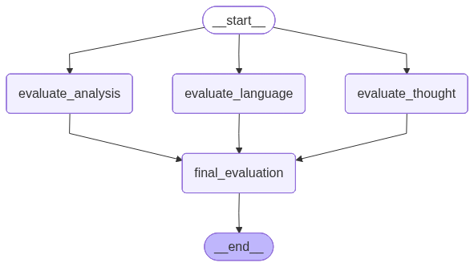

# 📝 AI-Powered Parallel Essay Evaluator

Welcome to the **AI-Powered Parallel Essay Evaluator**! This comprehensive application utilizes advanced AI and modern backend architecture to evaluate essays across multiple dimensions simultaneously. 

By leveraging **LangGraph**, **FastAPI**, and **Streamlit**, this project demonstrates a highly efficient parallel agentic workflow to deliver fast, structured, and insightful feedback on written content.

---

For more details, visit the [documentation](https://your-docs-link.com).

---


## 📂 Project Structure

```text
essay_evaluator/
│
├── app.py                            # Streamlit frontend application
├── main.py                           # FastAPI application & endpoints
├── workflow.py                       # LangGraph state graph and agent definitions
├── schemas.py                        # Pydantic schemas for structured IO
├── requirements.txt                  # Python dependencies
├── Parallel_workflow_Essay.ipynb     # Interactive notebook for testing & visualization
└── workflow_diagram.png              # Workflow diagram extracted from notebook
```

---

## 🚀 Getting Started

### 1. Installation

Clone the repository and install the required dependencies:

```bash

python -m venv venv
source venv/bin/activate  
```

```bash
pip install -r requirements.txt
```

### 2. Environment Variables

Create a `.env` file in the root directory and add your API key:

```env
GOOGLE_API_KEY=your_gemini_api_key_here
```
## 🌟 Key Features

- **Multi-Dimensional Analysis:** Evaluates essays on Language Quality, Depth of Analysis, and Clarity of Thought.
- **Parallel Execution:** Employs LangGraph to run independent AI evaluation agents concurrently, drastically reducing processing time.
- **Structured Output:** Uses `Pydantic` and LangChain to guarantee the AI responds with consistent, structured feedback and integer scores.
- **Robust API:** Powered by FastAPI for a high-performance backend.
- **Interactive UI:** A sleek, user-friendly Streamlit interface for seamless interaction and visual feedback.

---

##  Architecture & Workflow

The core of this application is its **parallel workflow**, orchestrated by **LangGraph**. Instead of evaluating the essay sequentially (which takes longer), the system fans out the task to three specialized agents, gathers their feedback, and synthesizes a final result.

### Visualizing the Workflow
*This diagram is extracted from the project's Jupyter Notebook, visualizing the actual compiled LangGraph execution path.*



### The Role of Agents

The workflow is divided into specific nodes (agents), each playing a distinct role:

1. **Language Evaluator (`evaluate_language`)** 
   - **Role:** Focuses on grammar, vocabulary, sentence structure, and overall fluency.
   - **Output:** Returns a detailed critique and a score out of 10.

2. **Analysis Evaluator (`evaluate_analysis`)** 
   - **Role:** Critiques the depth of arguments, strength of evidence, and originality.
   - **Output:** Returns a detailed critique and a score out of 10.

3. **Clarity Evaluator (`evaluate_thought`)** 
   - **Role:** Assesses logical flow, structural organization, and coherence.
   - **Output:** Returns a detailed critique and a score out of 10.

4. **Final Synthesizer (`final_evaluation`)** 
   - **Role:** This node waits for the three parallel agents to complete. It then aggregates their individual scores to calculate an **Average Score** and prompts the AI model to generate a cohesive **Overall Summary** based on the combined feedback.


